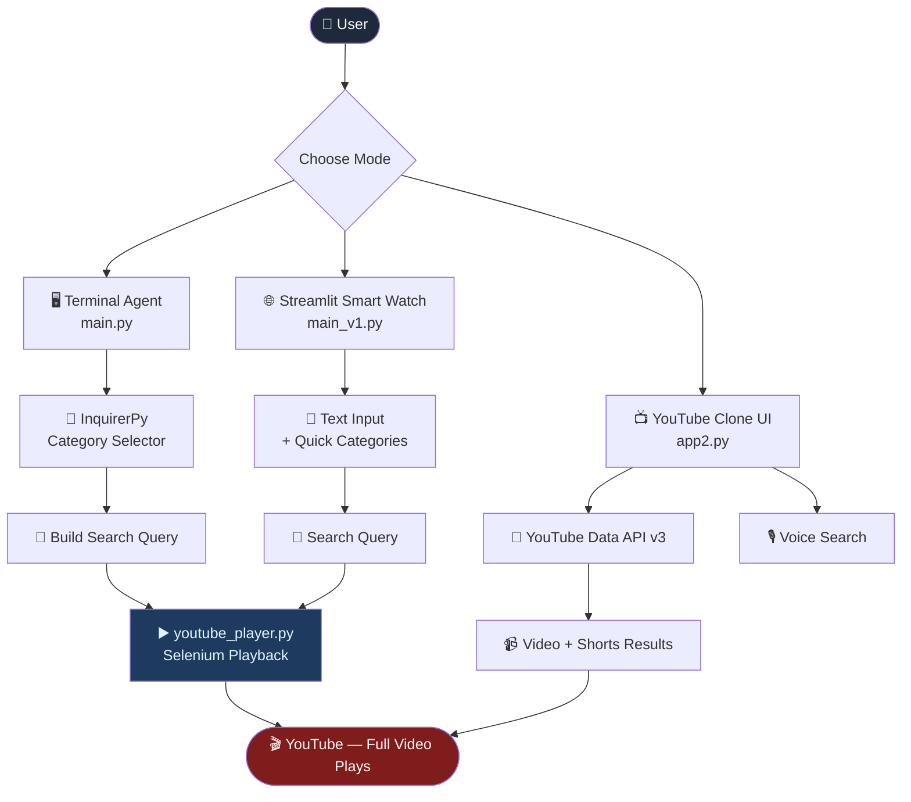

<div align="center">


<br/>

[](https://python.org)
[](https://streamlit.io)
[](https://selenium.dev)
[](https://developers.google.com/youtube)
[](https://sqlite.org)
[](LICENSE)
[](.)

<br/>

[](https://git.io/typing-svg)

<br/>

> *Three modes. One mission. Watch what you want — fast.*
> A multi-mode YouTube automation toolkit with CLI agent, Streamlit UI, and a full YouTube clone — all Shorts-free.

<br/>

</div>

---

## 📋 Table of Contents

- [Overview](#-overview)
- [Key Capabilities](#-key-capabilities)
- [System Architecture](#-system-architecture)
- [How It Works](#-how-it-works)
- [Tech Stack](#-tech-stack)
- [Environment Setup](#-environment-setup)
- [Quick Start](#-quick-start)
- [Project Structure](#-project-structure)
- [Design Decisions](#-design-decisions--trade-offs)
- [Roadmap](#-roadmap)
- [Author](#-author)

---

## 📖 Overview

Most YouTube experiences are hijacked by Shorts, autoplay rabbit holes, and an algorithm that decides what you watch.

**This project takes back control.**

It gives you three ways to find and watch exactly what you want — a terminal agent with deep category menus, a minimalist Streamlit watch UI, and a full YouTube clone powered by the real YouTube Data API v3. Every mode skips Shorts and plays full videos directly.

> Built to demonstrate real-world Python automation: browser control with Selenium, API integration, voice search, SQLite persistence, and Streamlit UI design.

---

## ⚡ Key Capabilities

| Capability | Details |
|---|---|
| 🖥️ **Terminal Agent** | InquirerPy-powered CLI with drill-down menus for F1, Anime, Gaming, Movies, and more |
| 🌐 **Streamlit Smart Watch** | Minimalist UI that searches YouTube via Selenium and auto-plays the first result |
| 📺 **YouTube Clone UI** | Dark-mode clone with video grid, Shorts row, tag filters, sidebar, and voice search |
| 🎙️ **Voice Search** | Speak your query via microphone — SpeechRecognition handles the rest |
| ⚡ **Shorts-Free Playback** | Automation skips Shorts entirely and targets full-length videos only |
| 🔌 **YouTube Data API v3** | Real search results for videos and Shorts via Google's official API |
| 🗄️ **SQLite Persistence** | Watch-later list, playlists, and user auth — all stored locally |
| 💡 **AI/LLM-Ready** | OpenAI + LangChain in dependencies for future intelligent query upgrades |

---

## 🏗️ System Architecture

### Mode Flow

```
┌─────────────────────────────────────────────────────────────┐
│                         User Input                          │
└──────────────┬──────────────────┬───────────────────────────┘
               │                  │                  │
        ┌──────▼──────┐   ┌───────▼──────┐   ┌──────▼──────┐
        │  Terminal   │   │  Streamlit   │   │  YouTube    │
        │  Agent      │   │  Smart Watch │   │  Clone UI   │
        │  main.py    │   │  main_v1.py  │   │  app2.py    │
        └──────┬──────┘   └───────┬──────┘   └──────┬──────┘
               │                  │                  │
        ┌──────▼──────┐   ┌───────▼──────┐   ┌──────▼──────┐
        │ InquirerPy  │   │  Selenium    │   │  YouTube    │
        │ Category    │   │  Browser     │   │  Data API   │
        │ Selector    │   │  Automation  │   │  v3         │
        └──────┬──────┘   └───────┬──────┘   └──────┬──────┘
               │                  │                  │
               └──────────────────┴──────────────────┘
                                  │
                      ┌───────────▼───────────┐
                      │   youtube_player.py   │
                      │   Selenium Playback   │
                      └───────────────────────┘
```

### Mermaid Diagram



---

## 🧠 How It Works

### Step-by-Step Pipeline

```
── Terminal Mode ──────────────────────────────────────────────
1. User launches main.py
2. InquirerPy presents category menu → F1 / Anime / Gaming / ...
3. Sub-menus drill down (e.g. F1 → Year → Grand Prix → Stage)
4. Query string is built and cleaned
5. Selenium opens Chrome → searches YouTube → clicks first result

── Streamlit Smart Watch ──────────────────────────────────────
1. User opens main_v1.py in browser
2. Types query or clicks a Quick Category button
3. Selenium launches Chrome with the search
4. First full-length result plays automatically

── YouTube Clone UI ───────────────────────────────────────────
1. User opens app2.py in browser
2. YouTube Data API v3 fetches real videos + Shorts
3. Dark-mode UI renders video grid and Shorts row
4. Voice search via microphone updates the query live
5. Clicking a Short opens the inline Shorts player
```

### Why Three Modes?

Each mode solves a different use case — power users who love terminal menus, casual users who want a clean browser UI, and anyone who wants a full YouTube-like experience without the algorithm. The modular design means each mode can be improved independently.

---

## 🔧 Tech Stack

| Layer | Technology | Role |
|---|---|---|
| **UI Framework** | Streamlit | Web UI for Smart Watch + Clone modes |
| **Browser Automation** | Selenium + WebDriver Manager | Auto-search and play on YouTube |
| **Video Data** | YouTube Data API v3 | Real video + Shorts search results |
| **CLI Interface** | InquirerPy | Terminal category selector menus |
| **Voice Input** | SpeechRecognition | Microphone-based search query |
| **Database** | SQLite3 | Watch-later, playlists, user auth |
| **HTTP / Async** | requests, aiohttp | API calls and async support |
| **Config** | python-dotenv | Secure environment variable loading |
| **Future AI Layer** | OpenAI, LangChain | Natural language query processing |
| **Language** | Python 3.10+ | Core runtime |

---

## 🔑 Environment Setup

Copy `.env.example` to `.env` and fill in your YouTube API key:

```bash
cp .env.example .env
```

```env
YOUTUBE_API_KEY=your_youtube_data_api_v3_key
```

Or set it directly in `youtube_api.py`:

```python
API_KEY = "YOUR_YOUTUBE_DATA_API_KEY_HERE"
```

> 🔑 Get your free key at [Google Cloud Console](https://console.cloud.google.com/) → Enable **YouTube Data API v3**
>
> ⚠️ Never commit your API key to version control.

---

## 🚀 Quick Start

```bash
# 1. Clone the repository
git clone https://github.com/loisekk/YouTube-Search-Quirer.git
cd YouTube-Search-Quirer

# 2. Create and activate a virtual environment
python -m venv venv
source venv/bin/activate        # Windows: venv\Scripts\activate

# 3. Install dependencies
pip install -r requirements.txt

# 4. Add your YouTube API key to youtube_api.py or .env

# 5. Run your preferred mode
python main.py                  # Terminal Agent
streamlit run main_v1.py        # Streamlit Smart Watch
streamlit run app2.py           # YouTube Clone UI
```

### Example Terminal Queries

```
Category  →  F1
Year      →  2023
GP        →  MONACO GRAND PRIX
Stage     →  RACE
Result    →  "F1 2023 MONACO GRAND PRIX RACE"

Category  →  ANIME
Title     →  SOLO LEVELING
Section   →  SEASON
Result    →  "SOLO LEVELING SEASON"

Category  →  STUDY-STUFF
Topic     →  AGENTIC AI
Level     →  ADVANCED
Result    →  "AGENTIC AI ADVANCED tutorial"
```

---

## 📂 Project Structure

```
📦 YouTube-Search-Quirer/
│
├── main.py                # Terminal agent — InquirerPy category flow + Selenium playback
├── main_v1.py             # Streamlit Smart Watch UI
├── app2.py                # Full YouTube Clone UI (API-powered)
│
├── youtube_api.py         # YouTube Data API v3 — search_videos() & search_shorts()
├── youtube_player.py      # Selenium playback module
├── voice_search.py        # Microphone voice input via SpeechRecognition
├── recommender.py         # Recommendation engine (history-based, expandable)
│
├── auth.py                # SQLite user authentication — register / login
├── database.py            # SQLite watch-later & playlists storage
│
├── requirements.txt       # All Python dependencies
├── .env.example           # Environment variable template
└── README.md              # You are here
```

---

## 🛡️ Design Decisions & Trade-offs

| Decision | Chosen Approach | Alternative Considered | Rationale |
|---|---|---|---|
| **Playback** | Selenium browser automation | YouTube iframe embed | Selenium plays full videos natively — no API embed restrictions |
| **Search Data** | YouTube Data API v3 | Web scraping | Official API is reliable, rate-limited, and returns clean structured data |
| **CLI UX** | InquirerPy menus | Plain `input()` prompts | Drill-down menus eliminate typos and guide the user to valid queries |
| **Voice Search** | SpeechRecognition (Google) | Whisper / local model | Zero setup, no model download, works out of the box |
| **Persistence** | SQLite3 | JSON files / Firebase | Lightweight, zero-config, runs fully local without any server |
| **UI** | Streamlit | Flask / FastAPI + HTML | Fastest path to a polished Python web UI with no frontend overhead |

---

## 🗺️ Roadmap

| Enhancement | Priority |
|---|---|
| 🧠 LLM-powered natural language query processing | High |
| 🗄️ Watch history tracking & smart recommendations | High |
| 🔐 User login with SHA-256 hashed passwords | Medium |
| 🎵 Playlist management UI | Medium |
| ⚡ Async execution — replace `requests` with `httpx` | Medium |
| 🐳 Docker support — containerized deployment | Low |
| 🧪 Evaluation suite — query quality benchmarking | Low |

---

## 👨‍💻 Author

<div align="center">

**Yash Brahmankar**

*Python & AI Developer · Automation · Agentic Systems*

<br/>

[](https://github.com/loisekk)
[](mailto:yashbrahmankar95@gmail.com)
[](https://linkedin.com/in/)

<br/>

⭐ **If this project was useful, a star goes a long way — thank you.**

</div>

---

<div align="center">


*Built with automation and Python by Yash Brahmankar*

</div>
